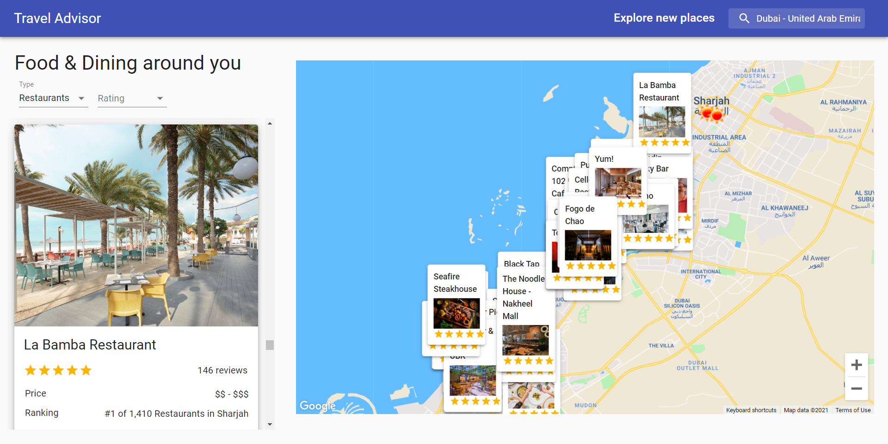

# Travel Advisor

## Introduction
Build and Deploy an advanced Travel Companion Application using Google Maps. With Geolocation, Google Maps API, Searching for places, Fetching restaurants, hotels and attractions based on location from specialized Rapid APIs, data filtering and much more, this Travel Advisor App is the best Maps Application that you can currently find on YouTube and on the entire internet.

[RapidAPI](https://rapidapi.com/hub?utm_source=youtube.com/JavaScriptMastery&utm_medium=DevRel&utm_campaign=DevRel)
[Travel Advisor API](https://rapidapi.com/apidojo/api/travel-advisor?utm_source=youtube.com/JavaScriptMastery&utm_medium=DevRel&utm_campaign=DevRel)
[Open Weather Map API](https://rapidapi.com/community/api/open-weather-map?utm_source=youtube.com/JavaScriptMastery&utm_medium=DevRel&utm_campaign=DevRel)

Preview The Live Project [click here](https://google-maps-travel-companion-application.netlify.app/).

## API:
* Maps JavaScript API
* Places API
* Travel Advisor API
* Open Weather Map API

### To Run the Application Simply Type in your Terminal: `npm start`
The project will run [http://localhost:3000](http://localhost:3000)
Open  to view it in the browser.

### To Build the Application Simply Type in your Terminal: `npm run build`

## How to Run on your Desktop:
Required tools:
* Install Node.js and npm
* Install the Git CLI
* Install Visual Studio Code or any other IDE You prefer

Simply Download the source code then extract the file and Open folder in VS Code or any IDE You Used. Install the dependencies in  node_module from package.json by command on your terminal `npm install`
then run `npm start` 

*** ENJOY ***
### Project Screenshot
